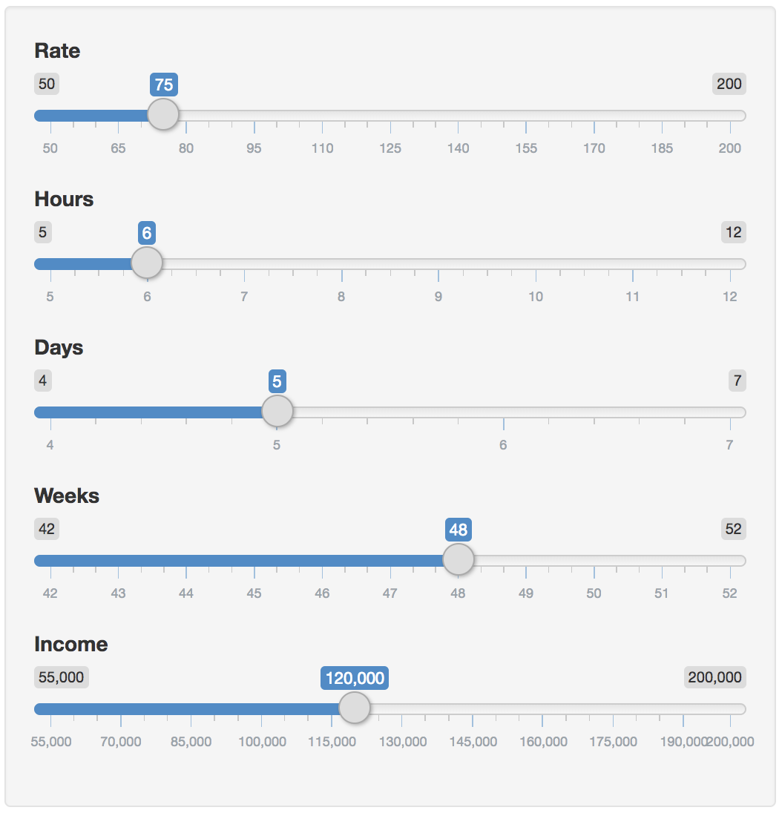
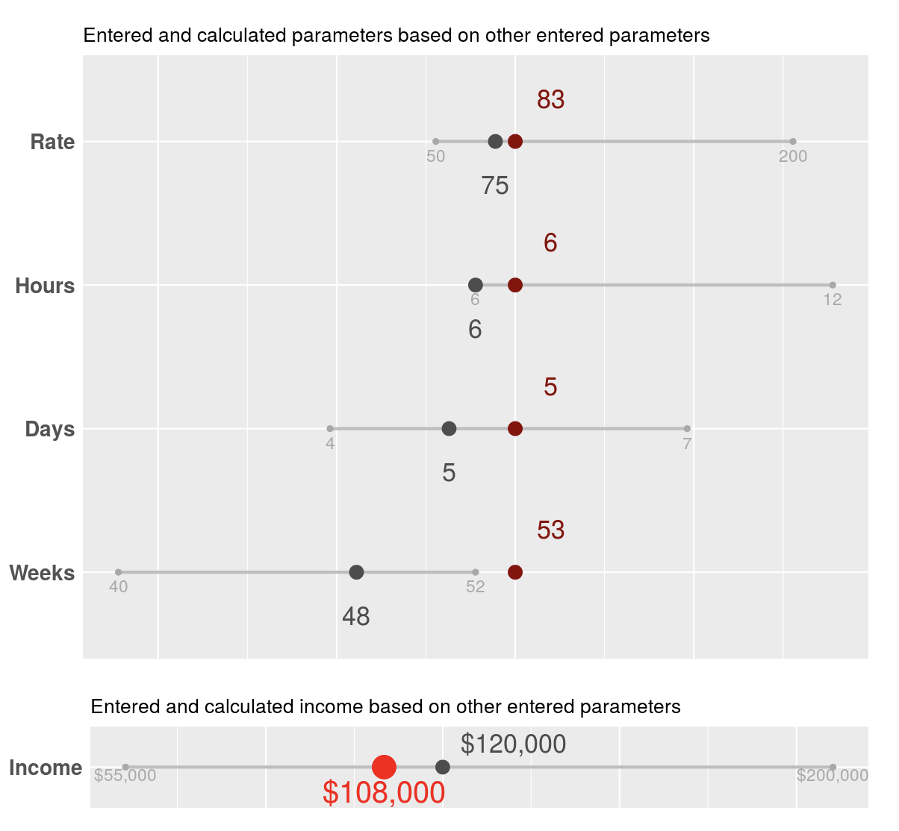
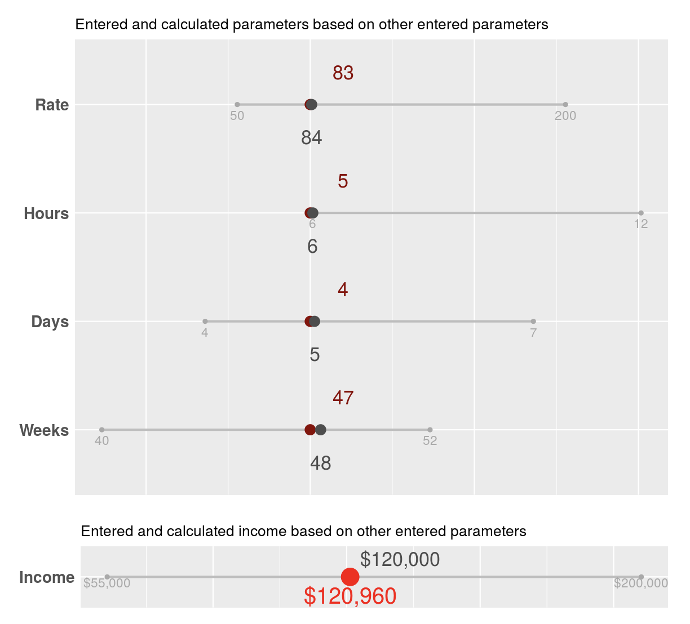
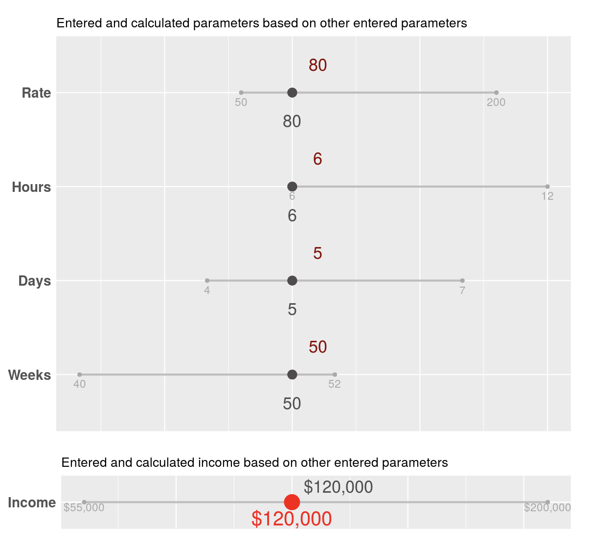

```{r setup, include=FALSE}
knitr::opts_chunk$set(echo = TRUE)
```

# My First Shiny app
### One year after building it and forgetting it

# [https://taraas.shinyapps.io/rate/](https://taraas.shinyapps.io/rate/)

Is it just me, or is your hard drive also full of abandoned projects, ideas et cetera? I know I’m not alone.

Cleaning up my R folder the other day, I stumbled upon a file I hardly remember creating. It is was a Shiny app built to help one calculate the hourly rate of services, given a desired income and an amount of time working (billable hours in a day, days in a week, weeks in a year). I think I built it watching the RStudio intro webinars into Shiny: [part 1](https://www.rstudio.com/resources/webinars/how-to-start-with-shiny-part-1/), [part 2](https://www.rstudio.com/resources/webinars/how-to-start-with-shiny-part-2/) and [part 3](https://www.rstudio.com/resources/webinars/how-to-start-with-shiny-part-3/).

The idea is that the user inputs all the values, and then the app suggests how to change any of the values to bring the system to the equilibrium.

Now that I’ve found the file, I’m publishing it as is at https://taraas.shinyapps.io/rate/. Below is the explanation and the code-through.

***

## How does it work

I know, I know, good UI needs no explanation. Please pardon my poor design. Finessing the details is something I may work on later. Today, I’m living by “ship daily” (first said by an unknown genius, and recently reminded me by dj patil in some tweet), and so I ship my minimum viable product

So, it works like this. First, you enter your desired figures into the input box. Let’s say, you are guessing a $75/hr rate, and you’re hoping to have 6 billable hours a day, working 5 days a week, 48 weeks a year. You’re hoping to make $100,000 a year in gross income




Now looking at the output pane, the result is not too far from our initial estimate, but we’re slightly off, making only $108,000 instead of $120,000:


 
   
How can we get to $120K? Well, the app suggests a few options:
  
- we can bump up our rate to $83/hr
- we can shoot for more than 6 hours billable hours a day (it still says 6, but that’s obviously rounding)
- we could keep the billable hours and the rate the same, but work more days a week
- we can leave all the parameters as they are, but increase the amount of weeks working from 48 to… 53. Bummer, a year only has 52 weeks, therefore this won’t work.
- we could settle for less and keep the $108K
- finally, we could find a compromise by changing every parameter slightly.

Moving the needle on any of these parameters will “stabilize” the system. Watch:

Changing the rate from $75 to $84/hour

Changing the rate to $80/hour and working 50 weeks a year



That is pretty much it, in a nutshell. I was interested in making this kind dynamic calculation possible. It took me a while, but it works as expected.


***

## The code
Here is a reminder for me: always annotate your code! When I dug it out last week, I could barely understand anything. I still don’t get a solid chunk of it.

I’m going to annotate it as much as I can, with the time I have. Hopefully you can comb through it.
Any improvements? Suggestions? It’s all on Github  —  you know what to do!

